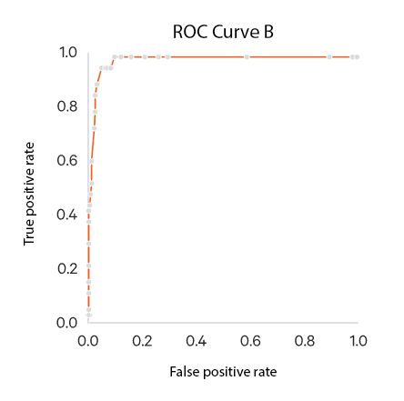

# Digital Appendix

This digital appendix contains the following files. 

* [Receiver Operating Characteristic (ROC) curves](ROCcurves)
* [Training documents used for semiautomatic classification](TrainingDocumentsFSW)
* [Original content of the R&S&copy; FSW WebHelp](WebHelpContentFSW)
* [Paramater file of the R&S&copy; FSW classifier](PrarameterFileFSW)

The current version of the R&S&copy; FSW WebHelp can be accessed [here](https://www.rohde-schwarz.com/webhelp/fsw_html_usermanuals_en_1/FSW_HTML_UserManuals_en.htm).

The thesis referencing this repository is available on [Researchgate](https://www.researchgate.net/publication/324532367_Classification_of_Technical_Documentation). Just follow this [ink/rabbit](https://www.researchgate.net/publication/324532367_Classification_of_Technical_Documentation). :rabbit: :v:

# ROC Curves

The Receiver Operating Characteristic (ROC) curves, including a confusion matrix, are shown below.

## ROC Curve A (Class 'Basics')

	AUC (Area Under the Curve) = 95%
	

## ROC Curve B (Class 'Examples and How-Tos')

	AUC (Area Under the Curve) = 98%
	

## ROC Curve C (Class 'Measurements')

	AUC (Area Under the Curve) = 85%
	

## ROC Curve D (Class 'Applications')

	AUC (Area Under the Curve) = 98%
	

## ROC Curve E (Class 'Configurations')

	AUC (Area Under the Curve) = 95%
	

## ROC Curve F (Class 'Results and Analysis')

	AUC (Area Under the Curve) = 95%
	

## ROC Curve G (Class 'Data Management')

	AUC (Area Under the Curve) = 96%
	

## ROC Curve H (Class 'Remote Commands')

	AUC (Area Under the Curve) = 98%
	

## ROC Curve I (Class 'Troubleshooting')

	AUC (Area Under the Curve) = 93%
	

## Confusion Matrix

 